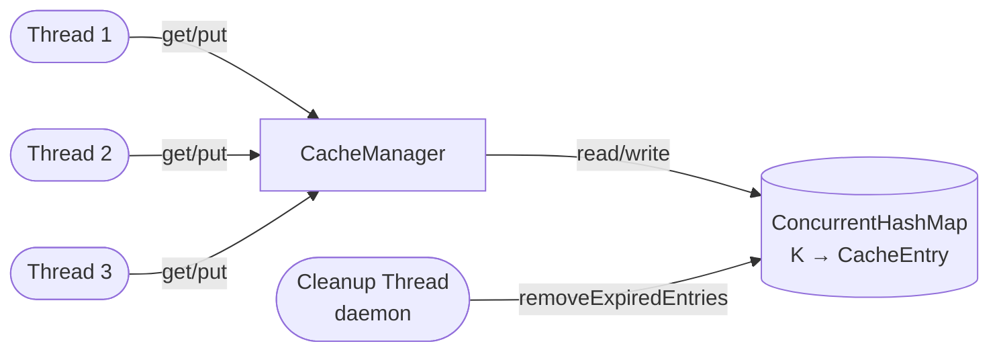
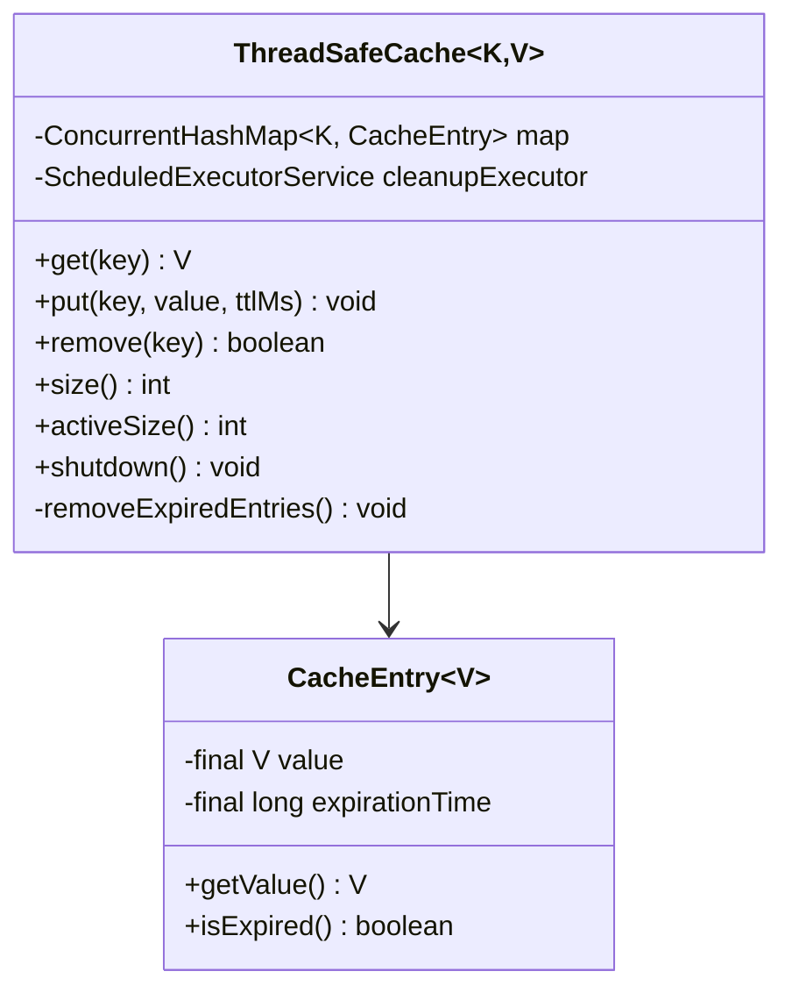
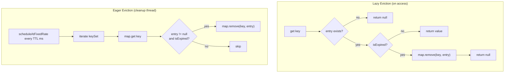
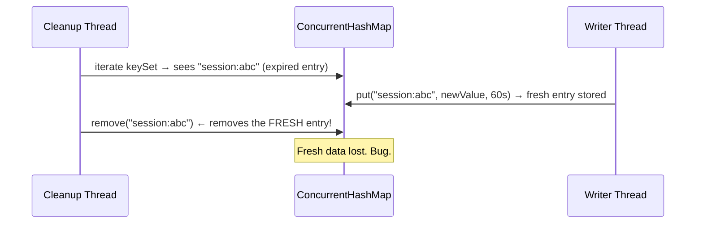
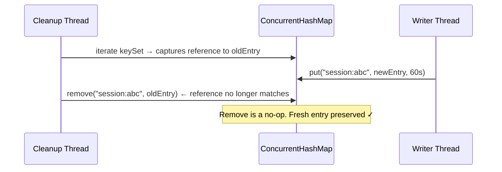
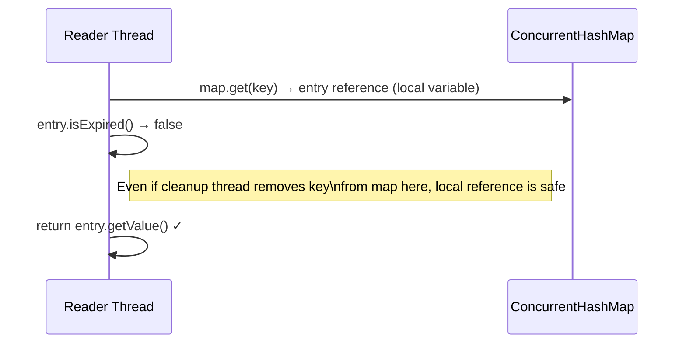
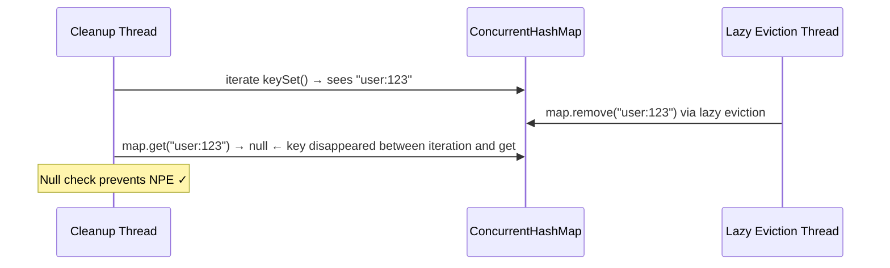
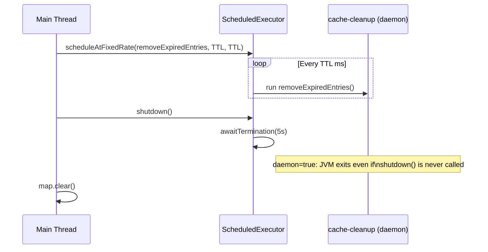

# Thread-Safe Cache

A concurrent in-memory key-value cache built in Java with per-entry TTL, lazy + eager eviction, and careful handling of every race condition that arises when multiple threads read, write, and clean up simultaneously.

---

## Core Requirements

- Key-value store with per-entry TTL
- Memory cleanup — no unbounded growth
- No stale reads
- Thread safety without a global lock

---

## Architecture





---

## TTL Design

`CacheEntry` stores an **absolute expiration timestamp**, not a relative TTL:

```java
CacheEntry(V value, long ttlMs) {
    this.expirationTime = System.nanoTime() + TimeUnit.MILLISECONDS.toNanos(ttlMs);
}

boolean isExpired() {
    return System.nanoTime() > expirationTime;
}
```

**Why `nanoTime` over `currentTimeMillis`?**

`nanoTime` measures elapsed time — monotonically increasing, immune to system clock adjustments (DST, NTP sync). `currentTimeMillis` is wall-clock time and can jump backwards. For TTL (a duration measurement, not a wall-clock event), `nanoTime` is always the right choice.

**Why absolute timestamp over relative TTL?**

If you stored the TTL as a relative `100ms`, you'd need to also store the creation time to know when to expire. Storing `creationTime + ttl` as a single absolute timestamp makes `isExpired()` a single comparison with no arithmetic.

---

## Cleanup: Lazy + Eager

Two complementary eviction strategies running simultaneously:



| | Lazy | Eager |
|---|---|---|
| When | On every `get` | Periodic background sweep |
| Advantage | Zero overhead for active keys | Cleans up keys nobody reads |
| Disadvantage | Expired entries linger until accessed | Imprecise — up to `TTL` ms late |
| Memory impact | Can accumulate stale entries | Bounds memory usage |

Both strategies use `map.remove(key, entry)` — never unconditional `map.remove(key)`. This is critical.

---

## The Concurrency Challenges

### Challenge 1: Put-Cleanup Race

The most dangerous bug — a cleanup thread evicts a freshly written entry.



**Root cause:** The cleanup decision was correct when made (entry was expired), but the map state changed before execution. `keySet` iteration and `remove` are not atomic.

**Fix:** Two-argument `map.remove(key, expectedEntry)` — conditional remove, CAS semantics:



```java
// WRONG — unconditional remove
if (entry.isExpired()) {
    map.remove(key);
}

// CORRECT — CAS remove, only removes if value is still the same object
CacheEntry<V> entry = map.get(key);
if (entry != null && entry.isExpired()) {
    map.remove(key, entry);
}
```

The same fix applies in the lazy eviction path inside `get()`.

---

### Challenge 2: Stale Read on Expiry Check

A reader checks expiry, sees valid, but by the time it reads the value — is there a race?



**This is NOT a race condition** — once `map.get()` returns, the reader holds a local reference to the `CacheEntry` object. Removing the key from the map doesn't nullify local references. The JVM won't GC the object while a live reference exists.

The only "race" is soft: the entry might be microseconds past its TTL by the time `getValue()` is called. For a cache this is acceptable — TTL is a soft guarantee, not a hard wall. If you need strict TTL semantics, use `computeIfPresent` to hold the bucket lock across check + read.

---

### Challenge 3: Mutable Entry — Partial State Visibility

This one is subtle and doesn't show up in tests, only in production under load.

If `CacheEntry` had mutable fields:

```java
// WRONG — mutable entry
entry.value = newValue;           // write 1
entry.expirationTime = newExpiry; // write 2
```

Modern CPUs use store buffers and out-of-order execution. Write 2 might be flushed to main memory before write 1. A reader on a different core could see:

```
value          → stale (old value, not yet flushed)
expirationTime → new  (already flushed)
```

Inconsistent state. No lock or `volatile` on individual fields fixes this fully — two separate volatile writes still have a window between them where a reader can observe a torn state.

**Fix:** Make `CacheEntry` immutable. All fields set in the constructor before the reference is published into the map. `ConcurrentHashMap.put()` acts as a memory barrier — by the time any thread can read the reference, the full object is already written and visible.

```java
// CORRECT — immutable entry, safe publication
class CacheEntry<V> {
    private final V value;           // final
    private final long expirationTime; // final
}
```

> `ConcurrentHashMap` protects the **pointer**. Immutability protects the **object the pointer points to**.

---

### Challenge 4: keySet → get Gap in Cleanup



`ConcurrentHashMap.keySet()` is *weakly consistent* — it reflects the map at some point during iteration but does not snapshot it. Keys can disappear between `keySet()` and `map.get()`. The null check in the cleanup loop is not paranoia; it handles this exact window.

```java
void removeExpiredEntries() {
    for (K key : map.keySet()) {
        CacheEntry<V> entry = map.get(key); // key may have been removed already
        if (entry != null && entry.isExpired()) {
            map.remove(key, entry);
        }
    }
}
```

---

## Why `ConcurrentHashMap` Is Not Enough Alone

`ConcurrentHashMap` gives you:
- ✓ Atomic single operations (`get`, `put`, `remove`)
- ✓ Bucket-level locking (not a global lock)
- ✓ Safe concurrent iteration without `ConcurrentModificationException`

`ConcurrentHashMap` does **not** give you:
- ✗ Atomicity **across** two operations (`get` then `remove`)
- ✗ Protection against partial state inside a mutable value object
- ✗ Any guarantee about the object a reference points to

Everything else in this implementation fills those gaps.

---

## Cleanup Thread Lifecycle



**Why daemon thread?**  
A non-daemon thread keeps the JVM alive. If `shutdown()` is never called, the cleanup thread would prevent the JVM from exiting. Daemon threads die automatically when all non-daemon threads finish.

**Why also have `shutdown()`?**  
Daemon is a safety net. `shutdown()` is graceful cleanup — stops new tasks from being scheduled, waits for any in-progress sweep to complete, then clears all entries. Without it, the cleanup thread holds a reference to `this` via `this::removeExpiredEntries`, making the cache object ineligible for GC.

---

## Why Not Per-Entry Scheduled Tasks (Like Ticket Booking)?

For a cache with high write throughput, scheduling one `ScheduledFuture` per entry is impractical:

| | Periodic Sweep | Per-Entry Schedule |
|---|---|---|
| Heap entries | 1 task always | 1 task per live entry |
| Memory (1M entries) | negligible | ~100-200MB for task objects |
| TTL precision | ±TTL ms | Exact |
| Key refresh | no-op | must cancel old task + schedule new |
| Write throughput | unaffected | O(log n) heap insert per put |

A cache accepts imprecise TTL in exchange for low overhead. A ticket booking hold needs exact expiry (a hold expiring 5 seconds late can cause payment races) — so it pays the per-entry scheduling cost.

---

## Running

```bash
mvn compile
mvn exec:java -Dexec.mainClass="org.example.Main"
```

Expected output:
```
Cache hits: 849
Cache misses: 151
Final cache size: 10
Final active size: 5
--- TTL Expiration Demo ---
Put 'session' with 500ms TTL
Immediate get: user-123
After 600ms: null
```

`size()` vs `activeSize()` gap — expired entries that lazy eviction hasn't encountered yet. Both converge to the same value after the next cleanup sweep.

---

## Concepts Demonstrated

- `ConcurrentHashMap` bucket-level locking vs global lock
- Immutable value objects and Java Memory Model safe publication
- Two-argument `map.remove(key, value)` for CAS-style conditional removal
- `nanoTime` vs `currentTimeMillis` for duration measurement
- Lazy (on-access) + eager (periodic) dual eviction strategy
- Daemon threads and graceful `ScheduledExecutorService` shutdown
- Why `ConcurrentHashMap` atomicity covers the pointer, not the object